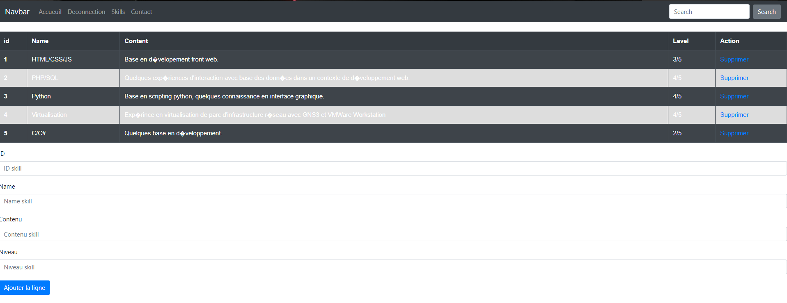
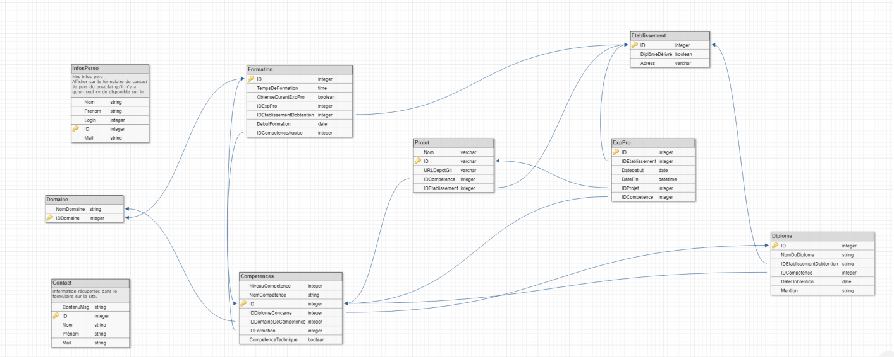

# Cv en ligne 

## Sommaire
* Introduction
* HTML/CSS
* JavaScript
* PHP
* MySQL
* Merise
* Référencement
* Bilan

## Introduction 

Dans le cadre d'un projet scolaire, il ma été demandé de développer et déployer un portfolio en ligne. Pour réaliser  ce projet j'ai eu recours a plusieurs technologie plus ou moins évidente à utiliser.
Le site est composé d'une one page et d'une page d'administration qui permet l'ajout et la suppression de données dans la base de données du site.  
 
## HTML/CSS

Les Template ont été réalisés en HTML (HyperText Markup Language), c'est un langage qui permet de la création de contenue web. Il est utilisé avec du CSS dans le but d'ajouter du style a ce contenue web. Dans le cadre de ce projet j'ai utilisé une CSS grid, ce qui permet d’agencer le contenue de la page en forme de grille ce qui facilite grandement le positionnement au seins de la page, d'autres fonctionnalités du CSS on été utilisés mais ce sont des fonctionnalités basique qui ne seront pas détaillées ici.

## Javascript

Le JavaScript a été en association avec l'HTML et le CSS afin de rendre le site plus vivant, grâce a une fonction de smooth scrolling qui permet d'utiliser les ancres (boutons dans la bar de navigation).

## PHP

Le PHP a été grandement utilisé dans ce projet, tout d’abord dans le but de factoriser un maximum le code, grâce a l'utilisation de connexion PDO qui permettent de récupérer des données dans des base de données. Les base de données pourront être gérées via l'interface d'administration du site, qui permettra d'ajouter et de supprimer des éléments de la base de données utilisée.

Le PHP a été aussi utilisé dans les algorithme de connexion a la base de données.

## MySQL

Le SQL a été utilisé dans une optique de création  de base de données qui seront utilisé dans l'optique de stocker les données relative au détenteur du site qui pourraient changer dans le futur.

## Merise 

Les schémas merise ont été utilisés lors de la création de la base de données, afin d'avoir une conception visuelle de la base, et ainsi permettre une meilleur visualisation des dépendance entre les tables.

## Référencement 

Les méthode référencement utilisé sont les suivantes :
		- Référencement naturel des balise (balise meta, titre, backlink)
		- Référencement payant : campagne adwords (A prévoir lors de la mise en ligne du site)

## Bilan 
Pour conclure les principales difficultés rencontrées on été lors de la création du script JavaScript, mais aussi lors des premières utilisations du CSS.
